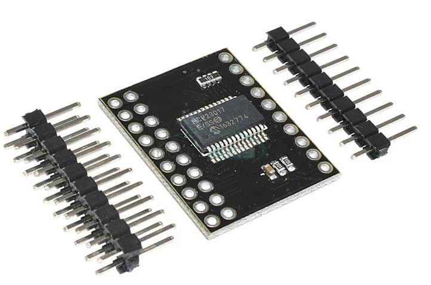

<h1 align="center">
  
  <br/>
  MCP23017
</h1>

<p align="center">
  <b>Take control of your GPIOs!</b>
</p>

<p align="center">
  <a href="https://www.ardu-badge.com/MCP23017_MR">
    
  </a>
  <a href="https://registry.platformio.org/libraries/alkonosst/MCP23017_MR">
    
  </a>
  <br><br>
  <a href="https://ko-fi.com/alkonosst">
    
    </a>
</p>

---

# Table of contents <!-- omit in toc -->

- [Description](#description)
- [Adding library to Arduino IDE](#adding-library-to-arduino-ide)
- [Adding library to platformio.ini (PlatformIO)](#adding-library-to-platformioini-platformio)
- [Using the library](#using-the-library)
  - [Including the library](#including-the-library)
  - [What is inside the library](#what-is-inside-the-library)
  - [Creating and initializing an instance of the MCP23017 class](#creating-and-initializing-an-instance-of-the-mcp23017-class)
  - [Manipulating individual pins](#manipulating-individual-pins)
    - [Pin mode](#pin-mode)
    - [Pull-up resistor](#pull-up-resistor)
    - [Invert input polarity](#invert-input-polarity)
    - [Interrupt mode](#interrupt-mode)
    - [Interrupt enable](#interrupt-enable)
  - [Manipulating entire ports](#manipulating-entire-ports)
  - [Reading the value of a pin or port](#reading-the-value-of-a-pin-or-port)
  - [Enabling interruptions and use of callbacks](#enabling-interruptions-and-use-of-callbacks)
  - [Interrupt modes and drawbacks](#interrupt-modes-and-drawbacks)
- [License](#license)

---

# Description

The **MCP23017** is a versatile I/O expander that allows you to control up to **16 additional GPIO pins** using just an I²C bus on your microcontroller. This library provides an easy-to-use interface for integrating the **MCP23017** into your Arduino projects, enabling you to effortlessly expand your I/O capabilities and take full control of your hardware.

Some of the core features are:

- Utilize safe functions to prevent accidental incorrect configurations, leveraging enum classes for type safety.
- Seamlessly configure and manage the **MCP23017**'s GPIO pins.
- Read from and write to individual pins or entire ports.
- Utilize interrupt capabilities for responsive and efficient I/O handling.

Unlock the full potential of your microcontroller with the **MCP23017** and this powerful library!

# Adding library to Arduino IDE

Search for the library in the Library Manager and install it.

# Adding library to platformio.ini (PlatformIO)

```ini
; Most recent changes
lib_deps =
  https://github.com/alkonosst/MCP23017.git

; Release vx.y.z (using an exact version is recommended)
; Example: v1.2.3
lib_deps =
  https://github.com/alkonosst/MCP23017.git#vx.y.z
```

# Using the library

## Including the library

```cpp
#include "MCP23017.h"
```

## What is inside the library

All the functionalities of the library are inside the `MCP23017` namespace. So you can access the
classes and functions like this:

```cpp
MCP23017::MCP23017_IO<> io(MCP23017::I2CAddress::A0_0_A1_0_A2_0, Wire);
```

If you prefer, you can rename the namespace to something shorter:

```cpp
namespace mcp = MCP23017;
mcp::MCP23017_IO<> io(mcp::I2CAddress::A0_0_A1_0_A2_0, Wire);
```

Or maybe you want to use the `using` directive:

```cpp
using namespace MCP23017;
MCP23017_IO<> io(I2CAddress::A0_0_A1_0_A2_0, Wire);
```

The library uses the `MCP23017::Status` enum to return the status of the functions. The possible
values. Almost every function returns a status code, so you can check if the operation was
successful.

```cpp
using namespace MCP23017;
MCP23017_IO<> io(I2CAddress::A0_0_A1_0_A2_0, Wire);

void setup() {
  Status status = io.init();

  if (status != Status::OK) {
    // Handle the error
  }
}
```

## Creating and initializing an instance of the MCP23017 class

The `MCP23017_IO` class is a template class that receives an enum class as a template parameter.
This is useful to define your own pin names and avoid using magic numbers.

The constructor needs the `I²C address` (_enum based on the An pins_) and the `Wire` object (default is **Wire**).

This is an example of how to create an instance of the `MCP23017_IO` class, using a custom enum
class to represent the pins connected to the MCP23017:

```cpp
// Define the custom enum class
// Take care to define the values between 0 and 15 (max. number of pins)
enum class MyPins : uint8_t {
  Button = 0,
  Led = 1,
  Buzzer = 2
  // Add more pins here
};

using namespace MCP23017;
MCP23017_IO<MyPins> io(I2CAddress::A0_0_A1_0_A2_0, Wire);

void setup() {
  // Initialization
  // ...

  // With the custom enum class, you obtain type safety and can use the pins like this:
  io.pinMode(MyPins::Button, Mode::Input);
  io.pinMode(MyPins::Led, Mode::Output);
  io.pinMode(MyPins::Buzzer, Mode::Output);

  // This would produce a compilation error, as the pin is not defined in the enum class:
  // io.pinMode(0, Mode::Output);
}
```

If you don't want to use a custom enum class, you can use leave the template parameter empty. This way, you can use the pins as numbers:

```cpp
using namespace MCP23017;
MCP23017_IO<> io(I2CAddress::A0_0_A1_0_A2_0, Wire);

void setup() {
  // Initialization
  // ...

  // You can use the pins as numbers, but be careful to not use numbers greater than 15:
  io.pinMode(0, Mode::Input);
  io.pinMode(1, Mode::Output);
  io.pinMode(2, Mode::Output);

  // This would be an error, as the pins are limited to 0-15:
  // "status" would be "Status::PinOutOfRange"
  Status status = io.pinMode(16, Mode::Output);
}
```

The `init` function initializes the MCP23017. It receives the `IntPinType` and `IntPinPol` as
parameters. These parameters define the interrupt pin physical behavior:

- When using the `IntPinType::OpenDrain` type, the `IntPinPol` parameter is ignored.
- When using the `IntPinType::PushPull` type, the interrupt pin could be configured as active high
  or active low using the `IntPinPol` parameter.

```cpp
using namespace MCP23017;
MCP23017_IO<> io(I2CAddress::A0_0_A1_0_A2_0, Wire);

void setup() {
  // Initialize I²C communication
  Wire.begin();

  // Check if the MCP23017 is connected
  if (!io.isConnected()) {
    // Handle the error
  }

  // Initialize the MCP23017 and configure the interrupt pin as open-drain
  Status status = io.init(IntPinType::OpenDrain);

  if (status != Status::OK) {
    // Handle the error
  }
}
```

## Manipulating individual pins

All the `MCP23017::pinXXX` methods are used to change the value of a specific bit on its respective
register, keeping the others unchanged. Internally, the library first reads the current value of the register, then compares it
with the new value. Only if they are different, the library writes the new value to the register.
This is done to prevent unnecessary I²C transactions.

Also, all these methods are `variadic templates`, meaning you can pass as many pins as
you want to them. This will write to the MCP23017 in a single I²C transaction. **You need to pass
always a pair of arguments: the pin and the value**.

```cpp
using namespace MCP23017;
MCP23017_IO<> io(I2CAddress::A0_0_A1_0_A2_0, Wire);

void setup() {
  // Initialization
  // ...

  // Set the pin 0 to input
  io.pinMode(0, Mode::Input);

  // Set the pin 1 and pin 2 to output, in a single I²C transaction
  io.pinMode(1, Mode::Output, 2, Mode::Output);

  // Set the pin 3, 4 and 5 to input, in a single I²C transaction
  io.pinMode(3, Mode::Input, 4, Mode::Input, 5, Mode::Input);

  // This would produce a compilation error, as the arguments are not in pairs:
  // io.pinMode(6, Mode::Input, 7);
}
```

### Pin mode

```cpp
// Set the pin 0 to input
io.pinMode(0, Mode::Input);

// Set the pin 1 and 2 to output
io.pinMode(1, Mode::Output, 2, Mode::Output);
```

### Pull-up resistor

```cpp
// Enable the pull-up resistor on pin 0
io.pinPullUp(0, PullUp::Enable);

// Disable the pull-up resistor on pin 1 and 2
io.pinPullUp(1, PullUp::Disable, 2, PullUp::Disable);
```

### Invert input polarity

```cpp
// Invert the input polarity on pin 0
io.pinInputPolarity(0, InputPol::Inverted);

// Don't invert the input polarity on pin 1 and 2
io.pinInputPolarity(1, InputPol::NoInverted, 2, InputPol::NoInverted);
```

### Interrupt mode

```cpp
// Set the interrupt mode on pin 0 to trigger on every change
io.pinInterruptMode(0, IntMode::Change);

// Set the interrupt mode on pin 1 to trigger on a rising edge
io.pinInterruptMode(1, IntMode::Rising);

// Set the interrupt mode on pin 2 and 3 to trigger on a falling edge
io.pinInterruptMode(2, IntMode::Falling, 3, IntMode::Falling);
```

### Interrupt enable

```cpp
// Enable the interrupt on pin 0
io.pinInterruptEnable(0, IntEnable::On);

// Disable the interrupt on pin 1 and 2
io.pinInterruptEnable(1, IntEnable::Off, 2, IntEnable::Off);
```

## Manipulating entire ports

If you need to set an entire port (_8 pins every port_) or all the 16 pins to the same value, you
can use the `MCP23017::portXXX` and `MCP23017::portsXXX` methods.

```cpp
using namespace MCP23017;
MCP23017_IO<> io(I2CAddress::A0_0_A1_0_A2_0, Wire);

void setup() {
  // Initialization
  // ...

  // Set the port A to input
  io.portMode(Port::PortA, Mode::Input);

  // Set the port B to output
  io.portMode(Port::PortB, Mode::Output);

  // Enable pull-ups on all pins
  io.portsPullUp(PullUp::Enable);
}
```

## Reading the value of a pin or port

You can read the value of a pin or port using the `MCP23017::pinDigitalRead`,
`MCP23017::portDigitalRead` and `MCP23017::portsDigitalRead` methods. Remember that all these methods
return a `Status` enum, so you need to pass a reference to a variable to store the value.

```cpp
using namespace MCP23017;
MCP23017_IO<> io(I2CAddress::A0_0_A1_0_A2_0, Wire);

void setup() {
  // Initialization
  // ...

  // Read the value of pin 0
  bool pin0_value;
  Status status = io.pinDigitalRead(0, pin0_value);

  if (status == Status::Ok) {
    Serial.printf("Pin 0 value: %u\n", pin0_value);
  }

  // Read the value of port A (mask of 8 bits for the 8 pins)
  uint8_t portA_value;
  status = io.portDigitalRead(Port::PortA, portA_value);

  if (status == Status::Ok) {
    Serial.printf("Port A value: 0x%02X\n", portA_value);
  }

  // Read the value of all pins (mask of 16 bits)
  uint16_t all_pins_value;
  status = io.portsDigitalRead(all_pins_value);

  if (status == Status::Ok) {
    Serial.printf("All pins value: 0x%04X\n", all_pins_value);
  }
}
```

## Enabling interruptions and use of callbacks

The **MCP23017** has two interrupt pins: **INTA** and **INTB**, one for each ports. The library uses
the `mirror` mode, meaning that these pins are connected internally. This way, you can use only one
interrupt pin to monitor both ports.

To the use interrupts, you need to attach a callback function to the interrupt pin, and configure
the edge mode depending on the physical connection of the interrupt pin (refer to `IntPinType` and `IntPinPol`).

Example on `ESP32`:

```cpp
using namespace MCP23017;
MCP23017_IO<> io(I2CAddress::A0_0_A1_0_A2_0, Wire);

// Pin connected to the interrupt pin
const uint8_t INT_PIN = 1;

// Flag to indicate that the interrupt was triggered
volatile bool interrupted = false;

// Interrupt callback function, make it as short and fast as possible
void IRAM_ATTR ISR() {
  interrupted = true;
}

void setup() {
  Serial.begin(115200);

  // Initialize the MCP23017 and configure the interrupt pin as open-drain
  // In this example, the interrupt pin would have an external pull-up resistor
  io.init(IntPinType::OpenDrain);

  // Initialize the interrupt pin and attach the interrupt callback function
  pinMode(INT_PIN, INPUT);
  attachInterrupt(INT_PIN, ISR, FALLING);

  // Configure the interrupt on pin 0 and enable it
  io.pinInterruptMode(0, IntMode::Change);
  io.pinInterruptEnable(0, IntEnable::On);
}

void loop() {
  // Check if the interrupt was triggered
  if (interrupted) {
    interrupted = false;

    int8_t detected_pin;
    uint16_t intcap_value;
    Status status = io.interruptedBy(detected_pin, intcap_value);

    if (status != Status::Ok) {
      Serial.printf("Failed to get interrupt info: %u\n", static_cast<uint8_t>(status));
    } else {
      Serial.printf("Interrupt on pin %d, INTCAP value: 0x%04X\n", detected_pin, intcap_value);
    }
  }
}
```

The library provides the use of callback functions to handle interrupts. By default, they are
disabled. To enable them, define the following macro before including the library:

```cpp
#define MCP23017_USE_CALLBACKS
#include "MCP23017.h"
```

If using PlatformIO, you could instead add this definition in your `platformio.ini` file:

```ini
build_flags =
  -D MCP23017_USE_CALLBACKS
```

After enabling the callbacks, you can use the `MCP23017::setCallback` method to attach a callback to
a specific pin. The callback function must have the following signature:

```cpp
void callback(const PinEnum pin, const bool value);
```

`PinEnum` is the enum class (if you are using one) or `uint8_t` if you are not using a custom enum
(refer to the [Creating and initializing an instance of the MCP23017
class](#creating-and-initializing-an-instance-of-the-mcp23017-class) section).

Also, you need to specify the trigger mode of the callback using the `IntMode` enum class.

```cpp
using namespace MCP23017;
MCP23017_IO<> io(I2CAddress::A0_0_A1_0_A2_0, Wire);

// Pin connected to the interrupt pin
const uint8_t INT_PIN = 1;

// Flag to indicate that the interrupt was triggered
volatile bool interrupted = false;

// Interrupt callback function, make it as short and fast as possible
void IRAM_ATTR ISR() {
  interrupted = true;
}

// Custom callback function
void callback(const uint8_t pin, const bool value) {
  Serial.printf("Interrupt on pin %u, value: %u\n", pin, value);
}

void setup() {
  Serial.begin(115200);

  // Initialize the MCP23017 and configure the interrupt pin as open-drain
  // In this example, the interrupt pin would have an external pull-up resistor
  io.init(IntPinType::OpenDrain);

  // Initialize the interrupt pin and attach the interrupt callback function
  pinMode(INT_PIN, INPUT);
  attachInterrupt(INT_PIN, ISR, FALLING);

  // Attach a callback function to pin 0 with the trigger mode set to rising edge
  // This callback will be called when the pin 0 changes from low to high,
  // independently of the interrupt pin mode
  io.setCallback(0, callback, IntMode::Rising);

  // Configure the interrupt on pin 0 and enable it
  io.pinInterruptMode(0, IntMode::Change);
  io.pinInterruptEnable(0, IntEnable::On);
}

void loop() {
  // Check if the interrupt was triggered
  if (interrupted) {
    interrupted = false;

    int8_t detected_pin;
    uint16_t intcap_value;

    // This function will trigger the custom callbacks functions on the pins that have them
    Status status = io.interruptedBy(detected_pin, intcap_value);

    if (status != Status::Ok) {
      Serial.printf("Failed to get interrupt info: %u\n", static_cast<uint8_t>(status));
    } else {
      Serial.printf("Interrupt on pin %d, INTCAP value: 0x%04X\n", detected_pin, intcap_value);
    }
  }
}
```

If you need to remove a callback function, you can use the `MCP23017::removeCallback` method.

```cpp
// Remove the callback function from pin 0
io.removeCallback(0);
```

## Interrupt modes and drawbacks

The **MCP23017** has two interrupt modes (_refer to section 3.5.5 of the datasheet_):

- `IntMode::Change` mode: Interrupt is triggered on any state change (low-to-high or high-to-low) on the configured pin.
  - **Advantages**:
    - **Asynchronous operation**: Interrupts are not blocked by the pin remaining in a high or low state.
    - **Simpler handling**: No need to monitor or reset the pin state after the interrupt. You only need to check the current pin value if necessary.
    - **No event loss**: Captures every transition, both rising and falling edges.
    - **Versatility**: Suitable for any application that needs to detect transitions, regardless of direction.
  - **Disadvantages**:
    - **Higher interrupt rate**: Triggers on both edges, which may generate unnecessary interrupts if only one edge is of interest.
- `IntMode::Rising` and `IntMode::Falling` modes: Interrupt is triggered only on a specific edge (rising: low-to-high, or falling: high-to-low), based on the configuration.
  - **Advantages**:
    - **Reduced interrupt rate**: Only triggers on the specified edge, saving CPU time and processing overhead.
    - **Targeted detection**: Ideal for applications where only one type of transition is meaningful (e.g., counting rising edges in a pulse counter or detecting button presses).
    - **Built-in edge filtering**: Hardware handles edge detection, avoiding the need for software-based filtering.
  - **Disadvantages**:
    - **Interrupt blocking**: If the pin remains in the triggered state (e.g., high after a rising edge), further interrupts are blocked until the pin returns to the original state. This can cause missed events.
    - **Complex handling**: The user must ensure that the pin state is reset (manually or naturally) before another interrupt can occur.
    - **Polling might be needed**: For reliable operation, you may need to poll the pin state to confirm it has returned to its original state, especially in edge cases where the pin could "stick" in the triggered state.
    - **Potential for missed events**: If multiple pins share an interrupt line and one pin gets "stuck" in the triggered state, other pins’ events might not be processed correctly.

As you can see, `IntMode::Rising` and `IntMode::Falling` modes can block the interrupt line if the pin remains in the triggered state. This can lead to missed events and unreliable operation. **Use these modes with caution and ensure that the pin state is reset before the next interrupt can occur**.

The recommended mode is `IntMode::Change` in almost all cases, as it is more versatile and easier to handle. If you need to execute some action only on a specific edge, you can use this mode combined with a callback configured to trigger only on the desired edge (_refer to the [Enabling interruptions and use of callbacks](#enabling-interruptions-and-use-of-callbacks) section_).

# License

This project is licensed under the MIT License - see the [LICENSE](LICENSE) file for details.
